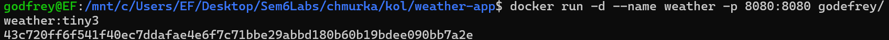
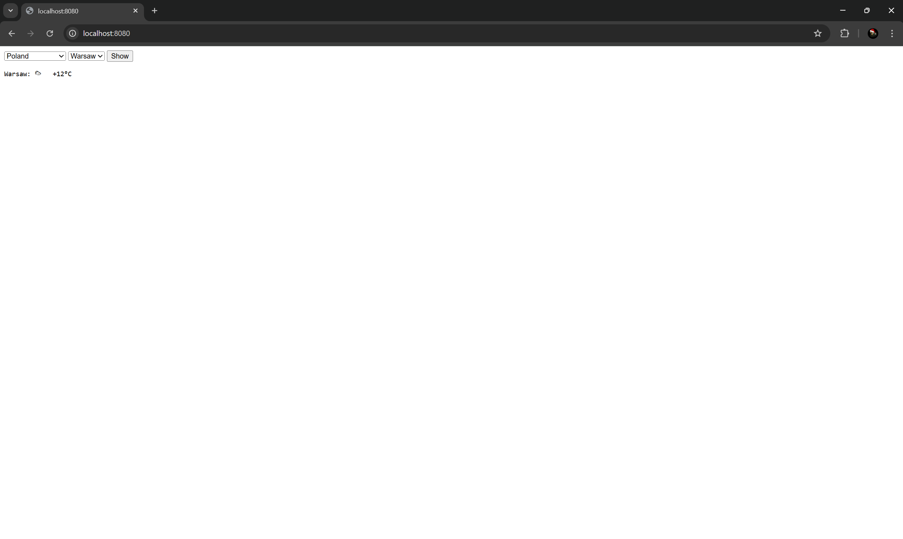
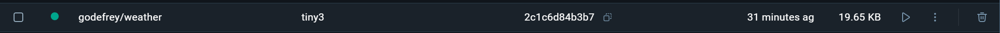

Zadanie 1 – część obowiązkowa
Linki
GitHub: https://github.com/GodEFreyy/weather-app
Docker Hub: https://hub.docker.com/r/godefrey/weather

1. Kod aplikacji
Plik server.S zawiera serwer w asemblerze. Plik page.html to prosty interfejs w przeglądarce.

2. Dockerfile
Dockerfile tworzy mały obraz z użyciem dwóch etapów. Na końcu zostaje tylko jeden plik wykonywalny. Autor: Nazar Malizderskyi.

3. Polecenia
a) Budowanie obrazu:
docker build -t godefrey/weather:tiny3 .

b) Uruchomienie kontenera:
docker run -d --name weather -p 8080:8080 godefrey/weather:tiny3

c) Wyświetlenie logów startowych:
docker logs weather
Przykład wyniku:
Container started. Author: Nazar Malizderskyi Port:8080

d) Sprawdzenie warstw i rozmiaru obrazu:
docker history --no-trunc godefrey/weather:tiny3

docker images godefrey/weather
Przykład rozmiaru: 19.7 kB

docker image inspect --format='{{.Size}}' godefrey/weather:tiny3
Przykład rozmiaru: 6126 B

4. Zrzuty ekranu
Logi startowe (po uruchomieniu kontenera)

Widok formularza w przeglądarce z wybraną pogodą

Wynik docker images pokazujący rozmiar obrazu
